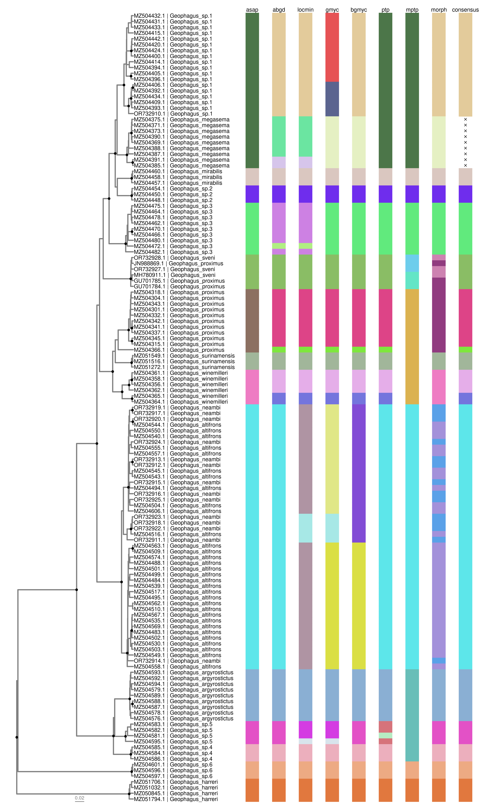

<!-- README.md is generated from README.Rmd. Please edit that file -->

# delimtools 

<!-- badges: start -->

[](https://cran.r-project.org/package=delimtools)
[](https://github.com/legalLab/delimtools/actions/workflows/R-CMD-check.yaml)
<!-- badges: end -->

## IMPORTANT

This software is under active development, and as such cannot be assumed
to be free of bugs or poor functionality. Always inspect results
carefully. If you find a problem, please report it with as much detail
as possible in [Issues](https://github.com/LegalLab/delimtools/issues).
Unfortunately in it’s current form, some of the functions (`abgd_tbl()`,
`asap_tbl()` and `mptp_tbl()`) will not work on Windows operating
systems, only on Unix (MacOS, Linux). This is because third party
binaries (executable programs) are required. We are working to implement
importing results from the webservers that are commonly used to run
these analyses. There are also difficulties with installing R required
package dependancies to run `gmyc_tbl()` and `bgmyc_tbl()` because these
are no longer under development and available on CRAN, and must be
installed from archived sources. Please refer to
[github.com/boopsboops/delimtools-testing](https://github.com/boopsboops/delimtools-testing/blob/main/scripts/install.md)
for instructions on how to install.

## Overview

The official GitHub repository for the R package `delimtools`
(Bittencourt et al., in prep.).

`delimtools` provides helper functions for the analysis of single-locus
species delimitation methods such as GMYC ([Monaghan et al.,
2009](https://doi.org/10.1093/sysbio/syp027)), bGMYC ([Reid & Carstens,
2012](https://doi.org/10.1186/1471-2148-12-196)), mPTP ([Kapli et al.,
2017](https://doi.org/10.1093/bioinformatics/btx025)) and ASAP
([Puillandre et al., 2020](https://doi.org/10.1111/1755-0998.13281)).
These software run multiple different platforms (e.g. R, Unix,
webservers), and also do not output their results in a consistent format
to allow easy comparison. To address these shortcomings we have
developed a suite of functions to standardise and simplify generating
single-locus species delimitations.

## Dependencies

Delimtools maily depends on the [tidyverse](https://www.tidyverse.org/)
and [ggtree](https://github.com/YuLab-SMU/ggtree) packages. To install
these, run the command lines below:

Install `tidyverse`:

``` r
install.packages("tidyverse")
```

Install `ggtree`

``` r
if (!require("BiocManager", quietly = TRUE))
    install.packages("BiocManager")

BiocManager::install("ggtree")
```

## Installation

To install `delimtools` you may execute the following commands. We
recommend the usage of the latest CRAN release always.

Latest stable version from CRAN

``` r
install.packages("delimtools")
```

Development version from GitHub:

``` r
devtools::install_github("LegalLab/delimtools")
```

Or a specific version via renv:

``` r
renv::install("LegalLab/delimtools@v0.1.0")
```

## Examples

Here, we will demonstrate a single-locus species delimitation analysis
on a *Geophagus* eartheater cichlid dataset ([Ximenes et al.,
2021](https://doi.org/10.7717/peerj.12443)) using a variety of methods.
For full details please see the GitHub repository accompanying this R
package at
[github.com/boopsboops/delimtools-testing](https://github.com/boopsboops/delimtools-testing).

<figure>

<figcaption aria-hidden="true">Redhead Eartheater <em>Geophagus
pyrocephalus</em></figcaption>
</figure>

``` r
library(delimtools)
library(dplyr)

# make tip label table
tip.tab <- geophagus_info |> 
  filter(gbAccession %in% geophagus_beast@phylo$tip.label) |>
  mutate(labs= glue::glue("{gbAccession} | {scientificName}")) |> 
  select(gbAccession, labs, scientificName)

# get cols
cols <- delim_brewer(delim= geophagus_delims, package="randomcoloR", seed=42)

# plot
delim_autoplot(delim = geophagus_delims, 
               tr = geophagus_beast, 
               consensus = TRUE,
               n_match = 4,
               delim_order = c("asap","abgd","locmin","gmyc","bgmyc","ptp", "mptp","morph"),
               tbl_labs = tip.tab, 
               col_vec = cols,
               hexpand = 0.7,
               widths = c(0.5, 0.5))
```

<!-- -->

## Current contributors

- [Pedro S. Bittencourt](https://github.com/pedrosenna)
- [Rupert A. Collins](https://github.com/boopsboops)
- [Tomas Hrbek](https://github.com/killidude)

## Meta

- Please [report here any issues or bugs or
  suggestions](https://github.com/legalLab/delimtools/issues).
- License: MIT.
- Get citation information for `delimtools` in R by running
  `citation(package='delimtools')`.
