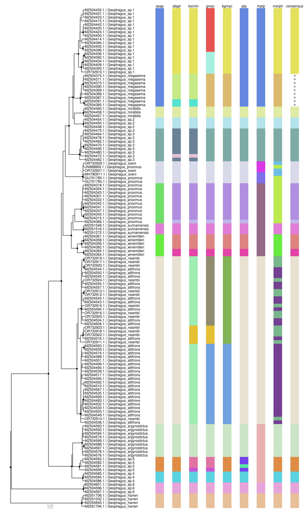

<!-- README.md is generated from README.Rmd. Please edit that file -->

# delimtools 

<!-- badges: start -->

[](https://cran.r-project.org/package=delimtools)
[](https://cran.r-project.org/package=delimtools)
<!-- badges: end -->

## IMPORTANT

This software is under development, and as such cannot be assumed to be
free of bugs or poor functionality. Always inspect results carefully. If
you find a problem, please report it with as much detail as possible in
[Issues](https://github.com/LegalLab/delimtools/issues). The current
version is completely stand alone, no longer depending on third party
binaries or R dependencies no longer available on CRAN. The affected
functions, however, retain their legacy behavior for now and
instructions for installing the third party binaries and R dependencies
are provided at
<https://legallab.github.io/delimtools/articles/install.html>. A
tutorial vignette running through all major package functionality is
found at
<https://legallab.github.io/delimtools/articles/delimtools.html>.

## delimtools v0.3.x - Announcement

As of v0.3.0, `delimtools` provides native R ports for all species
delimitation software currently supported by this package. This means
that ABGD, ASAP, bGMYC, GMYC and mPTP—previously dependent on external
binaries or third-party R packages—will run **entirely** within the R
environment, with performance-critical likelihood computations handled
by embedded C code.

These R ports were developed with the assistance of Claude (Anthropic),
under continuous human supervision. This porting process prioritized
**fidelity to the original source code**: algorithms, likelihood
functions, and core logic were preserved as closely as possible, with
changes limited to what was strictly necessary for integration into the
R/C ecosystem.

This change removes the Unix-only restriction that affected several
functions in earlier versions, making the full `delimtools` pipeline
**available on all platforms**, including **Windows**. Users will no
longer need to install or configure standalone executables to run any of
the supported methods. All currently implemented wrappers (\*\_tbl()
functions) will continue to be available for comparative purposes for
some time, but will eventually be deprecated in the next updates.

## Overview

This is the official GitHub repository for the R package `delimtools`
([Bittencourt, Collins & Hrbek,
2026](https://doi.org/10.1139/gen-2025-0119)).

Single-lucus species delimitation analyses have been implemented in a
diversity of packages that use different methods to delimit species.
These include GMYC ([Monaghan et al.,
2009](https://doi.org/10.1093/sysbio/syp027)), bGMYC ([Reid & Carstens,
2012](https://doi.org/10.1186/1471-2148-12-196)), mPTP ([Kapli et al.,
2017](https://doi.org/10.1093/bioinformatics/btx025)) and ASAP
([Puillandre et al., 2020](https://doi.org/10.1111/1755-0998.13281)).
These software run on different platforms (e.g. R, Unix, webservers),
and also do not output their results in a consistent format to allow
easy comparison. To address these shortcomings we have developed a suite
of functions in the `delimtools` package that replicate the behavior of
these software, and then standardize and simplify the output of these
functions. This then permits comparison of the delimitation analyses,
and unified visualization of the delimitation results.

## Dependencies

Delimtools mainly depends on the [tidyverse](https://tidyverse.org/) and
[ggtree](https://github.com/YuLab-SMU/ggtree) packages. To install
these, run the command lines below:

Install `tidyverse`:

``` r
install.packages("tidyverse")
```

Install `ggtree`

``` r
if (!require("BiocManager", quietly = TRUE))
    install.packages("BiocManager")

BiocManager::install("ggtree")
```

## Installation

To install `delimtools` you may execute the following commands. We
recommend the usage of the latest CRAN release always.

Latest stable version from CRAN

``` r
install.packages("delimtools")
```

Development version from GitHub:

``` r
pak::pak("LegalLab/delimtools")
# or alternately
devtools::install_github("LegalLab/delimtools")
# Windows and macOS binaries are also provided with each release (currently release v0.3.4)
install.packages("https://github.com/legalLab/delimtools/releases/download/v0.3.4/delimtools_0.3.4.zip", repos = NULL, type = "win.binary")
install.packages("https://github.com/legalLab/delimtools/releases/download/v0.3.4/delimtools_0.3.4.tgz", repos = NULL, type = "mac.binary")
```

Or a specific version via renv:

``` r
renv::install("LegalLab/delimtools@v0.1.0")
```

## Examples

Here, we will demonstrate plotting a single-locus species delimitation
analysis of a *Geophagus* eartheater cichlid dataset ([Ximenes et al.,
2021](https://doi.org/10.7717/peerj.12443)) using a diversity of
methods. A tutorial vignette running through all major package
functionality is found at
<https://legallab.github.io/delimtools/articles/delimtools.html>.

<figure>

<figcaption aria-hidden="true">Redhead Eartheater <em>Geophagus
pyrocephalus</em></figcaption>
</figure>

``` r
library(delimtools)
library(dplyr)

# make tip label table
tip.tab <- geophagus_info |> 
  filter(gbAccession %in% geophagus_beast@phylo$tip.label) |>
  mutate(labs = glue::glue("{gbAccession} | {scientificName}")) |> 
  select(gbAccession, labs, scientificName)

# get columns
cols <- delim_brewer(delim = geophagus_delims, package = "randomcoloR", seed = 42)

# plot
delim_autoplot(delim = geophagus_delims, 
               tr = geophagus_beast, 
               consensus = TRUE,
               n_match = 4,
               delim_order = c("asap","abgd","locmin","gmyc","bgmyc","ptp", "mptp","morph"),
               tbl_labs = tip.tab, 
               col_vec = cols,
               hexpand = 0.7,
               widths = c(0.5, 0.5))
```

<!-- -->

## Current contributors

- [Pedro S. Bittencourt](https://github.com/pedrosenna)
- [Rupert A. Collins](https://github.com/boopsboops)
- [Tomas Hrbek](https://github.com/killidude)

## Meta

- Please [report here any issues or bugs or
  suggestions](https://github.com/legalLab/delimtools/issues).
- License: MIT.
- Get citation information for `delimtools` in R by running
  `citation(package='delimtools')`.
