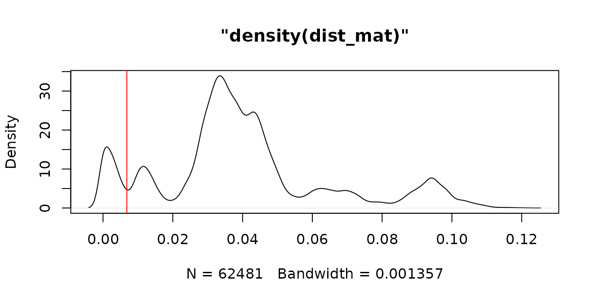
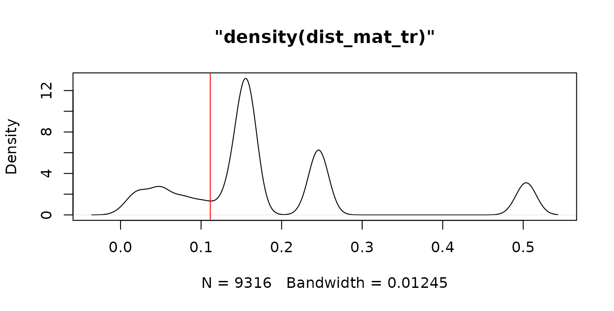
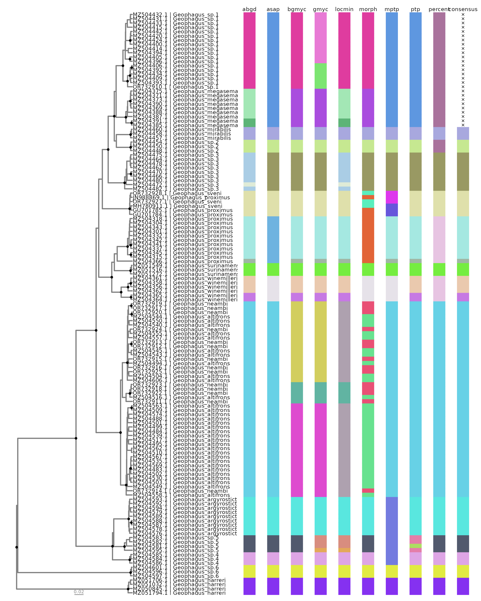

# Introduction to delimtools

### 

## Rationale

There are at least three major steps when doing single-locus species
delimitation analysis:

- Preparing your data;

- Running species delimitation analysis;

- Visualizing results.

The rationale of `delimtools` is to provide functions for all these
steps. This guide introduces you to these functions and shows how to
apply them to your datasets. In this tutorial, we will use the
`geophagus` dataset provided in this package. This dataset contains 354
cytochrome c oxidase sequences of the *Geophagus sensu stricto* species
group downloaded from GenBank. Most of these sequences are from Ximenes
et al. ([2021](https://doi.org/10.7717/peerj.12443)) and are documented
in [`?geophagus`](../reference/geophagus.md).

### Preparing your data

Usually, our main source of information for single-locus species
delimitation analysis is a
[FASTA](https://www.ncbi.nlm.nih.gov/genbank/fastaformat/) formated file
containing nucleotide sequences. The most straightforward way to import
a FASTA formatted file into R Environment is by using
[`ape::read.FASTA()`](https://rdrr.io/pkg/ape/man/read.dna.html):

``` r

path_to_file <- system.file("extdata/geophagus.fasta", package = "delimtools")

geophagus <- ape::read.FASTA(file = path_to_file)
```

Since the `geophagus` dataset is provided along with `delimtools`, one
can simply call it directly:

``` r

geophagus
#> 354 DNA sequences in binary format stored in a list.
#> 
#> All sequences of same length: 690 
#> 
#> Labels:
#> MZ504301.1
#> MZ504328.1
#> MZ504318.1
#> MZ504313.1
#> MZ504311.1
#> MZ504312.1
#> ...
#> 
#> Base composition:
#>     a     c     g     t 
#> 0.237 0.282 0.178 0.303 
#> (Total: 244.26 kb)
```

#### Check identifiers across files

Although the header of each FASTA file may contain both an ID and a
Description, we recommend keeping the header simple and only using ID.
The metadata (the Description) are easily stored in a tabular format
file (e.g. `csv`, `tsv`, `xlsx`, etc.), and linked to the FASTA file via
the ID. We provide such metadata in Darwin Core format. One can have a
glimpse of our *Geophagus* sequence metadata by checking
`geophagus_info`:

``` r

dplyr::glimpse(geophagus_info)
#> Rows: 354
#> Columns: 19
#> $ scientificName        <chr> "Geophagus_altifrons", "Geophagus_altifrons", "G…
#> $ scientificNameGenBank <chr> "Geophagus altifrons", "Geophagus altifrons", "G…
#> $ class                 <chr> "Teleostei", "Teleostei", "Teleostei", "Teleoste…
#> $ order                 <chr> "Cichliformes", "Cichliformes", "Cichliformes", …
#> $ family                <chr> "Cichlidae", "Cichlidae", "Cichlidae", "Cichlida…
#> $ genus                 <chr> "Geophagus", "Geophagus", "Geophagus", "Geophagu…
#> $ dbid                  <dbl> 2063684375, 2063684465, 2063684523, 2063684453, …
#> $ gbAccession           <chr> "MZ504486.1", "MZ504531.1", "MZ504560.1", "MZ504…
#> $ gene                  <chr> "coi", "coi", "coi", "coi", "coi", "coi", "coi",…
#> $ length                <dbl> 659, 699, 627, 612, 552, 654, 627, 651, 666, 609…
#> $ organelle             <chr> "mitochondrion", "mitochondrion", "mitochondrion…
#> $ catalogNumber         <chr> "1614", "17578", "1616", "1194", "2748", "1610",…
#> $ country               <chr> "Brazil: Tapajós- Jacareacanga- Pará", "Brazil: …
#> $ publishedAs           <chr> "Mapping the hidden diversity of the Geophagus s…
#> $ publishedIn           <chr> "Unpublished", "Unpublished", "Unpublished", "Un…
#> $ publishedBy           <chr> "Ximenes,A.M.", "Ximenes,A.M.", "Ximenes,A.M.", …
#> $ date                  <chr> "25-OCT-2021", "25-OCT-2021", "25-OCT-2021", "25…
#> $ decimalLatitude       <dbl> -6.276008, -3.449100, -6.276008, -1.501489, -6.1…
#> $ decimalLongitude      <dbl> -57.74000, -57.73533, -57.74000, -52.68211, -48.…
```

For downstream visualization, all FASTA IDs should have associated
metadata; however, the metadata may have more entries than sequences in
the FASTA file. The function
[`check_identifiers()`](../reference/check_identifiers.md) will check if
all FASTA IDs have entries in the metadata, and if there are any
duplicate IDs either in the FASTA file or in the metadata. Let’s check
if our FASTA file has associated metadata
[`check_identifiers()`](../reference/check_identifiers.md):

``` r

check_identifiers(dna = geophagus, identifier = "gbAccession", data = geophagus_info)
#> ✔ Identifiers passed all checks.
```

Now, let’s omit the first 10 sequences and check again:

``` r

check_identifiers(geophagus[11:354], "gbAccession", geophagus_info)
#> ✔ Identifiers passed all checks.
```

Now, let’s omit the first 4 metadata entries and check again:

``` r

check_identifiers(geophagus, "gbAccession", geophagus_info[5:354,])
#> Error in `check_identifiers()`:
#> ! Identifiers missing from metadata.
#> ✖ The following identifiers occur in sequence data `geophagus` but are absent
#>   from metadata `geophagus_info[5:354, ]`.
#> ℹ Missing identifiers:
#> MZ504525.1, MZ504531.1, MZ504560.1, MZ504486.1
```

Many other functions of `delimtools` rely on a tabular format file like
`geophagus_info`, so please make sure to have one prior to any analysis.

#### Cleaning DNA and Haplotype Collapsing

Sometimes, our alignment file may contain non *ACTG* bases, like
ambiguities (N, R, Y, etc), gaps (-), or missing data (?). Inclusion of
these bases in delimitation analyses may have unintended consequences in
delimitation analyses. We can use the function `clean_dna` to remove
these ambiguities. `clean_dna` will remove both leading and trailing
gaps from the alignment, therefore it will be necessary to realign the
dataset after calling `clean_dna`.

``` r

clean_geophagus <- clean_dna(geophagus)
#> Warning: ⚠ You have missing data "('N','-' '?')" or ambiguity inside your sequence, i.e.
#> not padding the ends, and this may have unintended consequences later, as they
#> have now been removed!
#> ℹ The names of the samples are below.
#> GU701784.1, GU701785.1
# and display
clean_geophagus
#> 354 DNA sequences in binary format stored in a list.
#> 
#> Mean sequence length: 646.198 
#>    Shortest sequence: 505 
#>     Longest sequence: 690 
#> 
#> Labels:
#> MZ504301.1
#> MZ504328.1
#> MZ504318.1
#> MZ504313.1
#> MZ504311.1
#> MZ504312.1
#> ...
#> 
#> Base composition:
#>     a     c     g     t 
#> 0.237 0.282 0.178 0.303 
#> (Total: 228.75 kb)
```

The presence of identical sequences (haplotypes) in an aligment will
overestimate the number of lineages detected by tree-based species
delimitation methods (e.g. bGMYC, GMYC, PTP, mPTP). Therefore it is best
practice to collapse identical haplotypes into unique haplotypes. This
is accomplished by calling the `hap_collapse` function. By default the
function will also call `clean_dna`.

``` r

collapsed_geophagus <- hap_collapse(geophagus)
#> Warning: ⚠ You have missing data "('N','-' '?')" or ambiguity inside your sequence, i.e.
#> not padding the ends, and this may have unintended consequences later, as they
#> have now been removed!
#> ℹ The names of the samples are below.
#> GU701784.1, GU701785.1
# and display
collapsed_geophagus
#> 137 DNA sequences in binary format stored in a list.
#> 
#> Mean sequence length: 643.007 
#>    Shortest sequence: 505 
#>     Longest sequence: 690 
#> 
#> Labels:
#> MZ504301.1
#> MZ504318.1
#> MZ504341.1
#> MZ504337.1
#> MZ504342.1
#> MZ504304.1
#> ...
#> 
#> Base composition:
#>     a     c     g     t 
#> 0.238 0.281 0.177 0.304 
#> (Total: 88.09 kb)
```

**Notice** that from the initial 354 DNA sequences, `hap_collapse`
returned a total of 136 unique DNA sequences. This result may vary if
setting `collapseSubstrings` to `FALSE`:

``` r

collapsed_geophagus <- hap_collapse(geophagus, collapseSubstrings = FALSE)
#> Warning: ⚠ You have missing data "('N','-' '?')" or ambiguity inside your sequence, i.e.
#> not padding the ends, and this may have unintended consequences later, as they
#> have now been removed!
#> ℹ The names of the samples are below.
#> GU701784.1, GU701785.1
# and display
collapsed_geophagus
#> 246 DNA sequences in binary format stored in a list.
#> 
#> Mean sequence length: 639.764 
#>    Shortest sequence: 505 
#>     Longest sequence: 690 
#> 
#> Labels:
#> MZ504301.1
#> MZ504328.1
#> MZ504318.1
#> MZ504341.1
#> MZ504337.1
#> MZ504299.1
#> ...
#> 
#> Base composition:
#>     a     c     g     t 
#> 0.237 0.282 0.177 0.303 
#> (Total: 157.38 kb)
```

After setting `collapseSubstrings` to `FALSE`, we obtained 246 unique
DNA sequences. These additional 108 sequences are in reality shorter but
identical sequences which differ only by the presence of leading and
trailing gaps. By setting both `clean_dna` and `collapseSubstrings` to
`TRUE`, the default of `hap_collapse`, we ensure the removal of these
leading and trailing gaps from sequences before collapsing these
sequences into unique haplotypes.

To visualize the relationships between these unique haplotypes and any
duplicates, we may use the `haplotype_tbl` function:

``` r

haplotype_tbl(geophagus, verbose = FALSE)
#> # A tibble: 137 × 3
#>    labels     n_seqs collapsed                                                  
#>    <chr>       <dbl> <chr>                                                      
#>  1 MZ504318.1     38 MZ504328.1, MZ504313.1, MZ504311.1, MZ504312.1, MZ504309.1…
#>  2 MZ504540.1     20 MZ504505.1, MZ504553.1, MZ504554.1, MZ504552.1, MZ504542.1…
#>  3 MZ504420.1     19 MZ504417.1, MZ504437.1, MZ504425.1, MZ504427.1, MZ504422.1…
#>  4 MZ504488.1     16 MZ504538.1, KU568830.1, JN026709.1, MZ504522.1, MZ504523.1…
#>  5 MZ504484.1     15 MZ504496.1, MZ504487.1, MZ504573.1, MZ504560.1, MZ504497.1…
#>  6 MZ504462.1     14 MZ504479.1, MZ504477.1, MZ504481.1, MZ504476.1, MZ504463.1…
#>  7 MZ504375.1     13 MZ504372.1, MZ504382.1, MZ504381.1, MZ504379.1, MZ504383.1…
#>  8 MZ504535.1      8 MZ504515.1, MZ504525.1, MZ504533.1, MZ504534.1, MZ504536.1…
#>  9 MZ504393.1      8 MZ504445.1, MZ504413.1, MZ504407.1, MZ504408.1, MZ504410.1…
#> 10 MZ504400.1      6 MZ504404.1, MZ504401.1, MZ504402.1, MZ504403.1, MZ504399.1 
#> # ℹ 127 more rows
```

We may also collapse other types of information by using
`collapse_others`. For example we may take the collapsed haplotype table
and onto it collapse our metadata to see, for example, which species and
sampling localities are associated with each haplotype:

``` r

haps_df <- haplotype_tbl(geophagus, verbose = FALSE)

collapse_others(data = geophagus_info, 
                hap_tbl = haps_df, 
                labels = "gbAccession", 
                cols = c("scientificName", "country"))
#> # A tibble: 137 × 5
#>    labels     n_seqs collapsed          collapsed_scientific…¹ collapsed_country
#>    <chr>       <dbl> <chr>              <chr>                  <chr>            
#>  1 MZ504318.1     38 MZ504328.1, MZ504… Geophagus_proximus     Brazil: Lago do …
#>  2 MZ504540.1     20 MZ504505.1, MZ504… Geophagus_altifrons, … Brazil: Tocantin…
#>  3 MZ504420.1     19 MZ504417.1, MZ504… Geophagus_sp.1         Brazil: Branco- …
#>  4 MZ504488.1     16 MZ504538.1, KU568… Geophagus_altifrons, … Brazil: Água Boa…
#>  5 MZ504484.1     15 MZ504496.1, MZ504… Geophagus_altifrons    Brazil: São Seba…
#>  6 MZ504462.1     14 MZ504479.1, MZ504… Geophagus_sp.3         Brazil: Iriri- P…
#>  7 MZ504375.1     13 MZ504372.1, MZ504… Geophagus_megasema     Brazil: Mamirauá…
#>  8 MZ504535.1      8 MZ504515.1, MZ504… Geophagus_altifrons    Brazil: Maués-Aç…
#>  9 MZ504393.1      8 MZ504445.1, MZ504… Geophagus_sp.1         Brazil: Xingu- u…
#> 10 MZ504400.1      6 MZ504404.1, MZ504… Geophagus_sp.1         Brazil: Demeni- …
#> # ℹ 127 more rows
#> # ℹ abbreviated name: ¹​collapsed_scientificName
```

### Running species delimitation analysis

After preparing your data (alignments and phylogenetic trees), the next
step it to run species delimitation analyses and combine them into a
single `tbl_df`. As of v0.3.0, `delimtools` includes as part of the
package executables of the ABGD, ASAP, GMYC, bGMYC, PTP and mPTP
methods, therefore, it requires no outside dependencies to run these
delimitation methods. However, `delimtools` maintains backward
compatibility, and will run external executables if so desired. Please
check [Installing Species Delimitation
Software](https://legallab.github.io/delimtools/articles/install.html)
to know which software `delimtools` supports.

Following are examples of species delimitation methods implemented in
`delimtools`. The first three methods are distance-based methods and
thus use the full aligned sequence matrix. Subsequent methods are
tree-based methods; the phylogenetic trees need to be estimated
externally, and should be based on unique haplotypes. For the
convenience of this vignette, we provide the full data matrix
(`geophagus`), a phylogram (`geophagus_raxml`) and a time-tree
(`geophagus_beast`) as part of this package.

#### ABGD

The ABGD method is run by executing the `abgd` function and giving it an
[`ape::DNAbin`](https://rdrr.io/pkg/ape/man/DNAbin.html) object which is
a S3 R object containing an aligned FASTA file. It will also accept
aligned FASTA and Phylip distance matrix. The result is then transformed
into a table using the `abgd_tbl` function.

``` r

# geophagus - the `ape::DNAbin` object supplied with this package

abgd_delim <- abgd(geophagus)
#> Simple distance
abgd_df <- abgd_tbl(abgd_delim)

# print the dataframe
print(abgd_df)
#> # A tibble: 354 × 2
#>    labels      abgd
#>    <chr>      <int>
#>  1 MZ504301.1     1
#>  2 MZ504328.1     1
#>  3 MZ504318.1     1
#>  4 MZ504313.1     1
#>  5 MZ504311.1     1
#>  6 MZ504312.1     1
#>  7 MZ504309.1     1
#>  8 MZ504341.1     1
#>  9 MZ504337.1     1
#> 10 MZ504299.1     1
#> # ℹ 344 more rows
```

#### ASAP

The ASAP method is run by executing the `asap` function and giving it an
[`ape::DNAbin`](https://rdrr.io/pkg/ape/man/DNAbin.html) object. It will
also accept a distance matrix. The result is then transformed into a
table using the `asap_tbl` function.

``` r

# geophagus - the `ape::DNAbin` object supplied with this package

asap_delim <- asap(geophagus)
asap_df <- asap_tbl(asap_delim)

# print the dataframe
print(asap_df)
#> # A tibble: 354 × 2
#>    labels      asap
#>    <chr>      <int>
#>  1 MZ504301.1     1
#>  2 MZ504328.1     1
#>  3 MZ504318.1     1
#>  4 MZ504313.1     1
#>  5 MZ504311.1     1
#>  6 MZ504312.1     1
#>  7 MZ504309.1     1
#>  8 MZ504341.1     1
#>  9 MZ504337.1     1
#> 10 MZ504299.1     1
#> # ℹ 344 more rows
```

#### Local Minima

We can run the Local Minima analysis by using the `spider` function
`localMinima`. This function requires a genetic distance matrix as input
for analysis.

``` r

dist_mat <- dist.dna(geophagus, model = "raw", pairwise.deletion = TRUE)

locmin <- spider::localMinima(dist_mat)
#> [1] 0.006828358 0.018994392 0.040791871 0.055999413 0.067151612 0.082105695
```

We can plot the `locmin` object to select the threshold. We will use the
first value of the `locmin` object:

``` r

plot(locmin) |> abline(v=locmin$localMinima[1],col="red")
```



Since `Local Minima` output is a numeric vector, we need to extract the
results using `locmin_tbl`.

``` r

locmin_df <- locmin_tbl(dist_mat, threshold = locmin$localMinima[1])

print(locmin_df)
#> # A tibble: 354 × 2
#>    labels     locmin
#>    <chr>       <int>
#>  1 MZ504301.1      1
#>  2 MZ504328.1      1
#>  3 MZ504318.1      1
#>  4 MZ504313.1      1
#>  5 MZ504311.1      1
#>  6 MZ504312.1      1
#>  7 MZ504309.1      1
#>  8 MZ504341.1      1
#>  9 MZ504337.1      1
#> 10 MZ504299.1      1
#> # ℹ 344 more rows
```

We can also use patristic distances to generate species partitions as
well. Using the `geophagus_beast` tree, we can apply a threshold to
classify tips of the tree by using its branch lengths:

``` r

dist_mat_tr <- ape::cophenetic.phylo(as.phylo(geophagus_beast)) |> as.dist()

locmin_tr <- spider::localMinima(dist_mat_tr)
#> [1] 0.1114476 0.2020889 0.3527801

plot(locmin_tr) |> abline(v=locmin_tr$localMinima[1],col="red")
```



``` r


treedist_df <- locmin_tbl(dist_mat_tr,
                          threshold = locmin_tr$localMinima[1],
                          delimname = "treedist")

print(treedist_df)
#> # A tibble: 137 × 2
#>    labels     treedist
#>    <chr>         <int>
#>  1 GU701784.1        1
#>  2 GU701785.1        1
#>  3 JN988869.1        1
#>  4 MH780911.1        1
#>  5 OR732927.1        1
#>  6 OR732928.1        1
#>  7 MZ050845.1        2
#>  8 MZ051032.1        2
#>  9 MZ051706.1        2
#> 10 MZ051794.1        2
#> # ℹ 127 more rows
```

### Fixed threshold

We can also use `locmin_tbl` to create a species partition using a fixed
threshold. For example, we can use a threshold of 2% to generate species
partitions:

``` r

percent_df <- locmin_tbl(dist_mat, threshold = 0.02, delimname = "percent")

print(percent_df)
#> # A tibble: 354 × 2
#>    labels     percent
#>    <chr>        <int>
#>  1 MZ504301.1       1
#>  2 MZ504328.1       1
#>  3 MZ504318.1       1
#>  4 MZ504313.1       1
#>  5 MZ504311.1       1
#>  6 MZ504312.1       1
#>  7 MZ504309.1       1
#>  8 MZ504341.1       1
#>  9 MZ504337.1       1
#> 10 MZ504299.1       1
#> # ℹ 344 more rows
```

#### GMYC

The GMYC method is run by executing the `gmyc` function and giving it an
[`ape::phylo`](https://rdrr.io/pkg/ape/man/read.tree.html) object. The
GMYC method requires an ultrametric tree file of class `phylo` as input
for analysis. We can convert our `geophagus_beast` treedata object into
a `phylo` object by using
[`ape::as.phylo`](https://rdrr.io/pkg/ape/man/as.phylo.html).

``` r

# geophagus_beast - the Newick formatted ultrametric phylogenetic tree object supplied with this package

beast_tree <- ape::as.phylo(geophagus_beast)
gmyc_delim <- gmyc(beast_tree)
```

Now, lets check the `summary`:

``` r

summary(gmyc_delim)
#> Result of GMYC species delimitation
#> 
#>  method: single
#>  likelihood of null model:   995.0483
#>  maximum likelihood of GMYC model:   1010.027
#>  likelihood ratio:   29.95779
#>  result of LR test:  3.124266e-07***
#> 
#>  number of ML clusters:  19
#>  confidence interval:    18-22
#> 
#>  number of ML entities:  21
#>  confidence interval:    19-25
#> 
#>  threshold time: -0.0164289
```

And let’s transform the results into a table using the `gmyc_tbl`
function.

``` r

gmyc_df <- gmyc_tbl(gmyc_delim)

# print the dataframe
print(gmyc_df)
#> # A tibble: 137 × 2
#>    labels      gmyc
#>    <chr>      <int>
#>  1 GU701784.1     1
#>  2 GU701785.1     1
#>  3 MH780911.1     1
#>  4 OR732927.1     1
#>  5 JN988869.1     1
#>  6 OR732928.1     1
#>  7 MZ504387.1     2
#>  8 MZ504388.1     2
#>  9 MZ504369.1     2
#> 10 MZ504390.1     2
#> # ℹ 127 more rows
```

#### bGMYC

The bGMYC method is run by executing the `bgmyc` function and giving it
an [`ape::phylo`](https://rdrr.io/pkg/ape/man/read.tree.html) object.
The bGMYC method requires an ultrametric tree file of class `phylo` as
input for analysis. We can convert our `geophagus_beast` treedata object
into a `phylo` object by using
[`ape::as.phylo`](https://rdrr.io/pkg/ape/man/as.phylo.html).

``` r

# geophagus_beast - the Newick formatted ultrametric phylogenetic tree object supplied with this package

beast_tree <- ape::as.phylo(geophagus_beast)
bgmyc_delim <- bgmyc(beast_tree)
#> bGMYC (C engine): 137 tips, 11000 MCMC steps, 100 post-burnin samples
#> 10%
#> 20%
#> 30%
#> 40%
#> 50%
#> 60%
#> 70%
#> 80%
#> 90%
#> 100%
#> Acceptance rates (py / pc / t):
#> 0.5241  0.8390  0.3480
```

The results then need to be transformed into a table using the
`bgmyc_tbl` function. By default, `0.05` is used as default posterior
probability threshold for clustering samples into species partitions.

``` r

bgmyc_df <- bgmyc_tbl(bgmyc_delim)

print(bgmyc_df)
#> # A tibble: 137 × 2
#>    labels     bgmyc
#>    <chr>      <int>
#>  1 GU701784.1     1
#>  2 GU701785.1     1
#>  3 JN988869.1     1
#>  4 MH780911.1     1
#>  5 MZ050845.1     2
#>  6 MZ051032.1     2
#>  7 MZ051272.1     3
#>  8 MZ051516.1     3
#>  9 MZ051549.1     3
#> 10 MZ051706.1     2
#> # ℹ 127 more rows
```

#### PTP and mPTP

We can run both PTP and mPTP analysis by using the `mptp` function.
Specifying the arguments (“multi” for mPTP; “single” for PTP) in the
parameters determines which analysis is performed; the default is
“multi” for mPTP. The `mptp` function accepts either phylo tree object
or a Newick tree file.

``` r

# geophagus_raxml - the Newick formatted phylogenetic tree object supplied with this package

mptp_delim <- mptp(as.phylo(geophagus_raxml))
#> Score Null Model: 681.702507
#> Number of delimited species: 14

mptp_df <- mptp_tbl(mptp_delim)
```

``` r

# geophagus_raxml - the Newick formatted phylogenetic tree object supplied with this package

ptp_delim <- mptp(as.phylo(geophagus_raxml), method = "single")
#> Score Null Model: 681.702507
#> Number of delimited species: 17

ptp_df <- mptp_tbl(ptp_delim)
```

To estimate a minimum branch length for your dataset, use `minbr_len`.

``` r

min_brlen(as.phylo(geophagus_raxml))
#> ℹ Printing 5 smallest tip-to-tip distances in a tree with 137 tips ...
#> 
#> 
#> |dist     |  n|
#> |:--------|--:|
#> |0.000002 | 12|
#> |0.000003 |  2|
#> |0.000004 |  6|
#> |0.000005 |  2|
#> |0.001561 |  2|
```

#### Morphology

We can also turn species ranks or results from morphological analysis
into a species partition by using `morph_tbl`. For the `geophagus`
dataset, we will use the scientific names in `geophagus_info` to
accomplish this.

``` r

morph_df <- morph_tbl(labels = geophagus_info$gbAccession, 
                      sppVector = geophagus_info$scientificName) |>
  dplyr::filter(labels %in% haps_df$labels)

print(morph_df)
#> # A tibble: 137 × 2
#>    labels     morph
#>    <chr>      <int>
#>  1 MZ504501.1     1
#>  2 MZ504504.1     1
#>  3 MZ504510.1     1
#>  4 MZ504543.1     1
#>  5 MZ504545.1     1
#>  6 MZ504488.1     1
#>  7 MZ504483.1     1
#>  8 MZ504558.1     1
#>  9 MZ504484.1     1
#> 10 MZ504502.1     1
#> # ℹ 127 more rows
```

### Joining Species Delimitation Outputs

Since we have several species partitions, we need to merge them into a
single data frame in order to visualize the results. However, since each
method has its own rankings, we need to recode them prior to any further
analysis. For this task, we can use `delim_join`. This function takes a
`list` of species partitions to recode and then join.

``` r

all_delims <- list(abgd_df, asap_df, bgmyc_df, gmyc_df, 
                   locmin_df, morph_df, mptp_df, ptp_df, 
                   percent_df, treedist_df)

all_delims_df <- delim_join(all_delims)
#> Warning: Dimensions are not the same across tables.
#> ✖ You've supplied inputs with different dimensions.
#> ℹ `delim 1` has 354 rows and 2 columns
#> ℹ `delim 2` has 137 rows and 2 columns
#> Dimensions are not the same across tables.
#> ✖ You've supplied inputs with different dimensions.
#> ℹ `delim 1` has 354 rows and 2 columns
#> ℹ `delim 2` has 137 rows and 2 columns
#> Dimensions are not the same across tables.
#> ✖ You've supplied inputs with different dimensions.
#> ℹ `delim 1` has 354 rows and 2 columns
#> ℹ `delim 2` has 137 rows and 2 columns
#> Dimensions are not the same across tables.
#> ✖ You've supplied inputs with different dimensions.
#> ℹ `delim 1` has 354 rows and 2 columns
#> ℹ `delim 2` has 137 rows and 2 columns
#> Dimensions are not the same across tables.
#> ✖ You've supplied inputs with different dimensions.
#> ℹ `delim 1` has 354 rows and 2 columns
#> ℹ `delim 2` has 137 rows and 2 columns
#> Dimensions are not the same across tables.
#> ✖ You've supplied inputs with different dimensions.
#> ℹ `delim 1` has 354 rows and 2 columns
#> ℹ `delim 2` has 137 rows and 2 columns
```

We can summarize the `all_delims_df` object by using the `report_delim`
function.

``` r

report_delim(all_delims_df)
#> ℹ Joined delimitations have a total of 45 unique species partitions.
#> ℹ Check below the number of species partitions per method:
#> 
#> 
#> |method   | partitions|
#> |:--------|----------:|
#> |gmyc     |         21|
#> |locmin   |         21|
#> |abgd     |         19|
#> |bgmyc    |         19|
#> |ptp      |         17|
#> |morph    |         16|
#> |asap     |         14|
#> |mptp     |         14|
#> |percent  |         12|
#> |treedist |          7|
#> # A tibble: 137 × 11
#>    labels     abgd  asap  bgmyc gmyc  locmin morph mptp  ptp   percent treedist
#>    <chr>      <chr> <chr> <chr> <chr> <chr>  <chr> <chr> <chr> <chr>   <chr>   
#>  1 MZ504301.1 sp1   sp20  sp1   sp1   sp1    sp36  sp1   sp1   sp40    sp44    
#>  2 MZ504318.1 sp1   sp20  sp1   sp1   sp1    sp36  sp1   sp1   sp40    sp44    
#>  3 MZ504341.1 sp1   sp20  sp1   sp1   sp1    sp36  sp1   sp1   sp40    sp44    
#>  4 MZ504337.1 sp1   sp20  sp1   sp1   sp1    sp36  sp1   sp1   sp40    sp44    
#>  5 MZ504342.1 sp1   sp20  sp1   sp1   sp1    sp36  sp1   sp1   sp40    sp44    
#>  6 MZ504304.1 sp1   sp20  sp1   sp1   sp1    sp36  sp1   sp1   sp40    sp44    
#>  7 MZ504332.1 sp1   sp20  sp1   sp1   sp1    sp36  sp1   sp1   sp40    sp44    
#>  8 MZ504343.1 sp1   sp20  sp1   sp1   sp1    sp36  sp1   sp1   sp40    sp44    
#>  9 MZ504315.1 sp1   sp20  sp1   sp1   sp1    sp36  sp1   sp1   sp40    sp44    
#> 10 MZ504345.1 sp1   sp20  sp1   sp1   sp1    sp36  sp1   sp1   sp40    sp44    
#> # ℹ 127 more rows
```

We can also check the match ratio statistics of Ahrens et al (2014)
using `match_ratio`.

``` r

match_ratio(all_delims_df) |> 
  dplyr::arrange(dplyr::desc(match_ratio)) |> 
            print(n=Inf)
#> # A tibble: 45 × 5
#>    pairs            delim_1 delim_2 n_match match_ratio
#>    <chr>              <int>   <int>   <int>       <dbl>
#>  1 abgd-locmin           19      21      17        0.85
#>  2 bgmyc-gmyc            19      21      17        0.85
#>  3 asap-percent          14      12      10        0.77
#>  4 abgd-bgmyc            19      19      14        0.74
#>  5 abgd-ptp              19      17      13        0.72
#>  6 bgmyc-ptp             19      17      13        0.72
#>  7 asap-ptp              14      17      11        0.71
#>  8 gmyc-locmin           21      21      15        0.71
#>  9 bgmyc-locmin          19      21      14        0.7 
#> 10 gmyc-ptp              21      17      13        0.68
#> 11 asap-morph            14      16      10        0.67
#> 12 mptp-ptp              14      17      10        0.65
#> 13 asap-mptp             14      14       9        0.64
#> 14 bgmyc-morph           19      16      11        0.63
#> 15 locmin-ptp            21      17      12        0.63
#> 16 ptp-percent           17      12       9        0.62
#> 17 abgd-asap             19      14      10        0.61
#> 18 asap-bgmyc            14      19      10        0.61
#> 19 abgd-gmyc             19      21      12        0.6 
#> 20 abgd-percent          19      12       9        0.58
#> 21 bgmyc-percent         19      12       9        0.58
#> 22 morph-percent         16      12       8        0.57
#> 23 abgd-morph            19      16       9        0.51
#> 24 asap-gmyc             14      21       9        0.51
#> 25 gmyc-morph            21      16       9        0.49
#> 26 abgd-mptp             19      14       8        0.48
#> 27 bgmyc-mptp            19      14       8        0.48
#> 28 gmyc-percent          21      12       8        0.48
#> 29 morph-ptp             16      17       8        0.48
#> 30 morph-mptp            16      14       7        0.47
#> 31 asap-locmin           14      21       8        0.46
#> 32 gmyc-mptp             21      14       8        0.46
#> 33 mptp-percent          14      12       6        0.46
#> 34 locmin-morph          21      16       8        0.43
#> 35 locmin-percent        21      12       7        0.42
#> 36 percent-treedist      12       7       4        0.42
#> 37 locmin-mptp           21      14       7        0.4 
#> 38 asap-treedist         14       7       4        0.38
#> 39 mptp-treedist         14       7       4        0.38
#> 40 ptp-treedist          17       7       4        0.33
#> 41 abgd-treedist         19       7       4        0.31
#> 42 bgmyc-treedist        19       7       3        0.23
#> 43 gmyc-treedist         21       7       3        0.21
#> 44 locmin-treedist       21       7       3        0.21
#> 45 morph-treedist        16       7       2        0.17
```

By checking the results, all comparisons including treedist have a low
`match_ratio`. Since species partitions with very low `match_ratio`
values can impact consensus calculations, we will remove treedist before
visualizing our results.

``` r

all_delims_df <- dplyr::select(all_delims_df, -treedist)

report_delim(all_delims_df)
#> ℹ Joined delimitations have a total of 43 unique species partitions.
#> ℹ Check below the number of species partitions per method:
#> 
#> 
#> |method  | partitions|
#> |:-------|----------:|
#> |gmyc    |         21|
#> |locmin  |         21|
#> |abgd    |         19|
#> |bgmyc   |         19|
#> |ptp     |         17|
#> |morph   |         16|
#> |asap    |         14|
#> |mptp    |         14|
#> |percent |         12|
#> # A tibble: 137 × 10
#>    labels     abgd  asap  bgmyc gmyc  locmin morph mptp  ptp   percent
#>    <chr>      <chr> <chr> <chr> <chr> <chr>  <chr> <chr> <chr> <chr>  
#>  1 MZ504301.1 sp1   sp20  sp1   sp1   sp1    sp36  sp1   sp1   sp40   
#>  2 MZ504318.1 sp1   sp20  sp1   sp1   sp1    sp36  sp1   sp1   sp40   
#>  3 MZ504341.1 sp1   sp20  sp1   sp1   sp1    sp36  sp1   sp1   sp40   
#>  4 MZ504337.1 sp1   sp20  sp1   sp1   sp1    sp36  sp1   sp1   sp40   
#>  5 MZ504342.1 sp1   sp20  sp1   sp1   sp1    sp36  sp1   sp1   sp40   
#>  6 MZ504304.1 sp1   sp20  sp1   sp1   sp1    sp36  sp1   sp1   sp40   
#>  7 MZ504332.1 sp1   sp20  sp1   sp1   sp1    sp36  sp1   sp1   sp40   
#>  8 MZ504343.1 sp1   sp20  sp1   sp1   sp1    sp36  sp1   sp1   sp40   
#>  9 MZ504315.1 sp1   sp20  sp1   sp1   sp1    sp36  sp1   sp1   sp40   
#> 10 MZ504345.1 sp1   sp20  sp1   sp1   sp1    sp36  sp1   sp1   sp40   
#> # ℹ 127 more rows
```

### Visualizing Results

We can visualize the results by using `delim_autoplot`. This function
will plot a phylogenetic tree alongside with the results contained in
`all_delims_df`. We will use the `geophagus_beast` tree to visualize the
results.

``` r


# customize tip labels of the tree
tip_tab <- geophagus_info |> 
  dplyr::filter(gbAccession %in% geophagus_beast@phylo$tip.label) |>
  dplyr::mutate(labs = glue::glue("{gbAccession} | {scientificName}")) |> 
  dplyr::select(gbAccession, labs, scientificName)

# create a customized color palette
cols <- delim_brewer(delim = all_delims_df, package = "randomcoloR", seed = 42)

# plot
delim_autoplot(all_delims_df, 
               geophagus_beast,
               consensus = TRUE,
               n_match = 5,
               tbl_labs = tip_tab,
               col_vec = cols,
               hexpand = 0.7,
               widths = c(0.5, 0.5))
```


